# Algorithms from Curves and Surfaces CAGD
Algorithms from Curves and Surfaces CAGD implemented for visualization and just fun.

Screenshots:

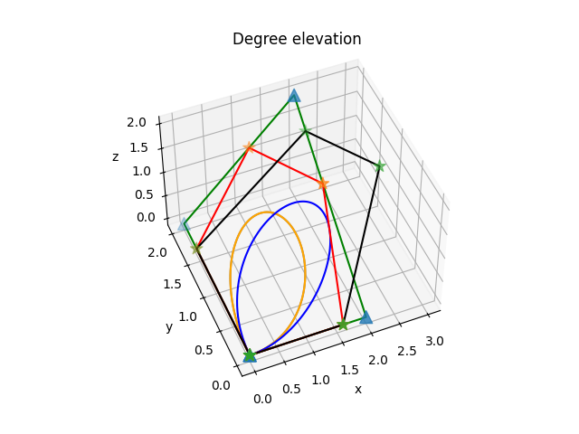   

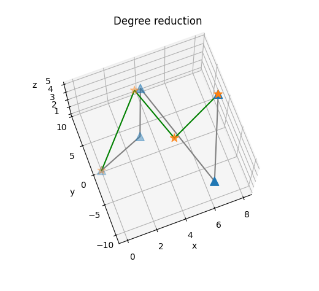   

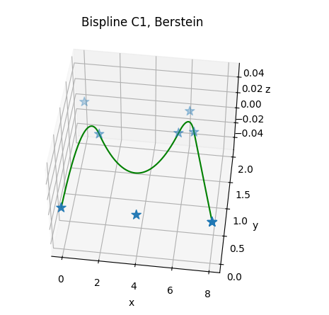   

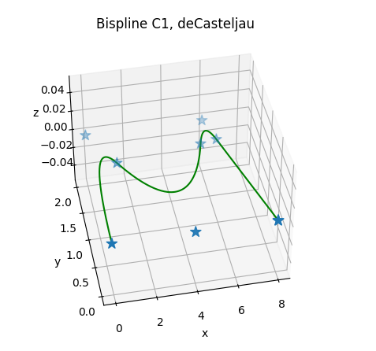   

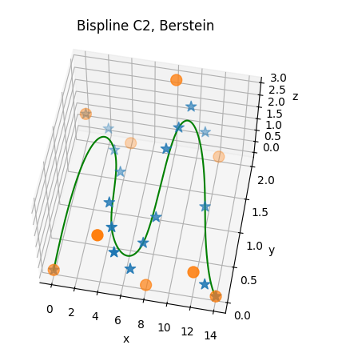   

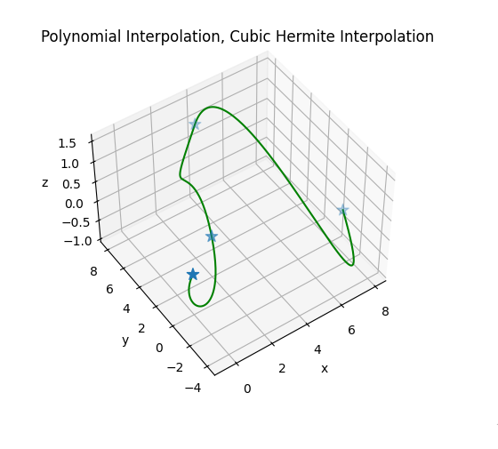 

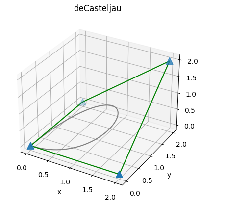   

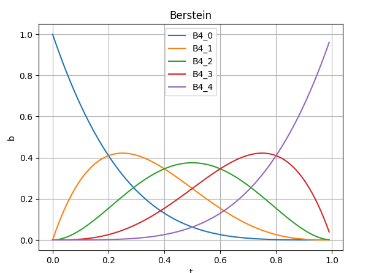  

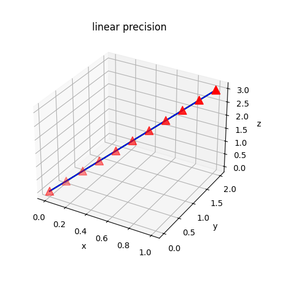 

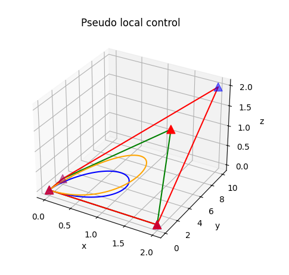 

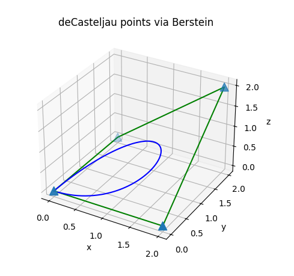  

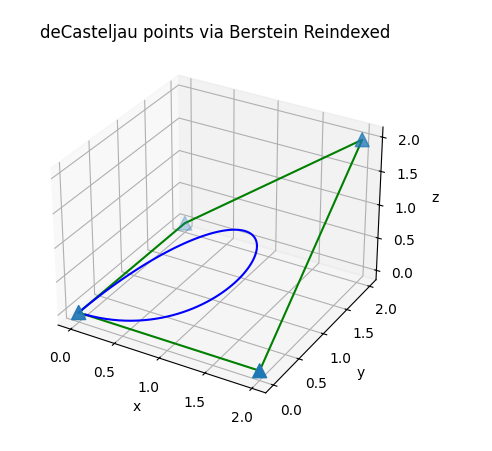   

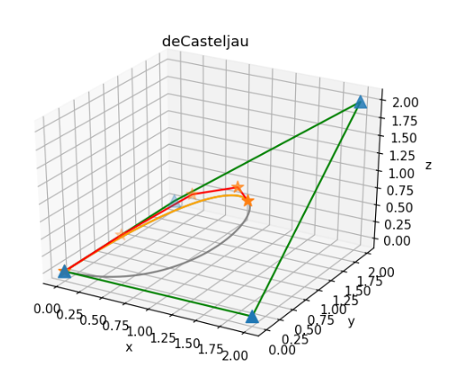   

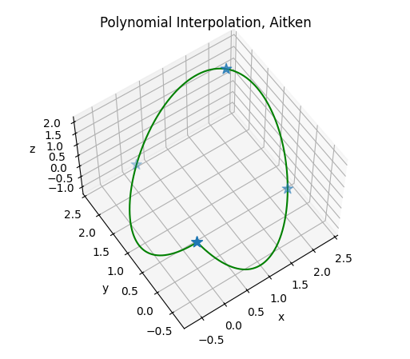   

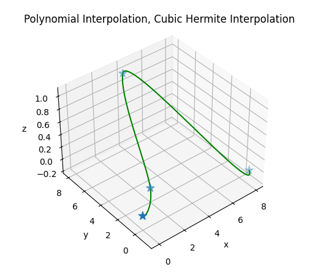  

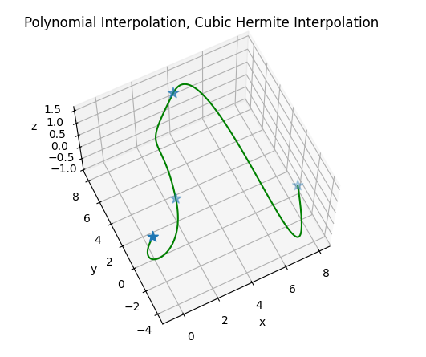 

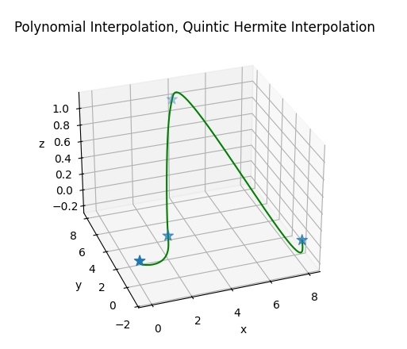  

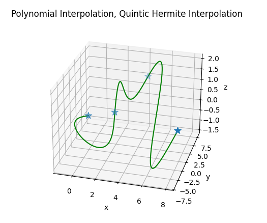  

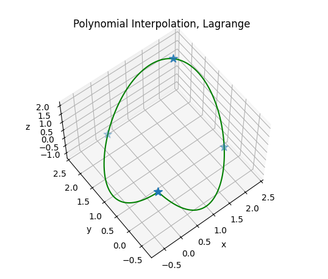  

